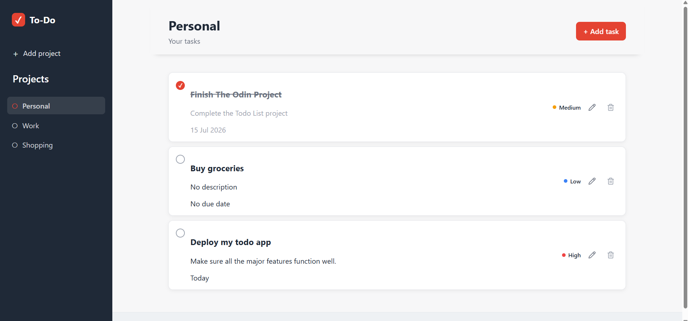
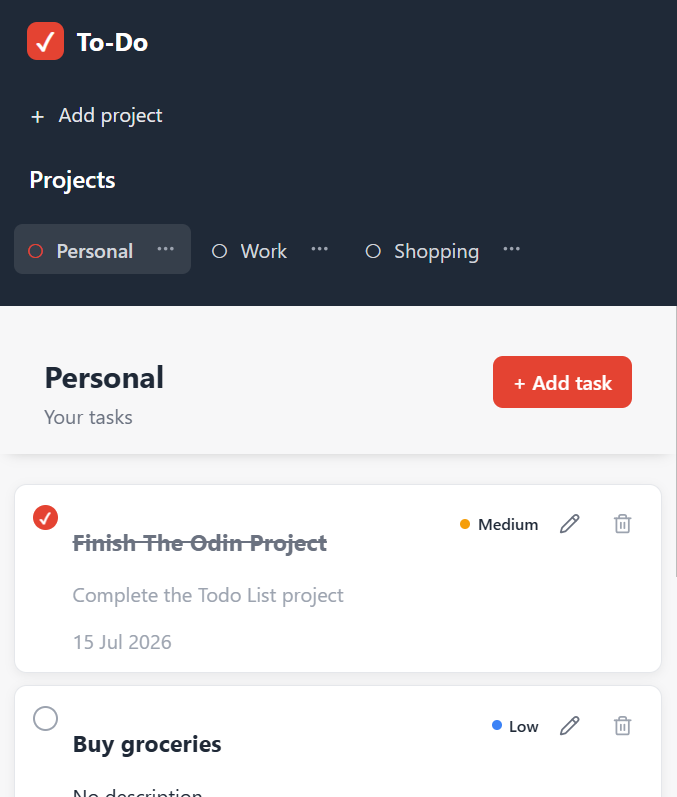

# To-Do

A responsive task management application built with vanilla JavaScript. Users can organize tasks into projects, manage task details and priorities, mark tasks as complete, and keep their data saved locally in the browser.

This project was built as part of [The Odin Project](https://www.theodinproject.com/) JavaScript curriculum, with a focus on modular JavaScript, application architecture, Webpack, and DOM manipulation.

## Features

* Create and manage projects
* Rename projects
* Delete projects with confirmation
* Create, edit, and delete todos
* Assign priorities to tasks
* Set and display due dates
* Mark tasks as completed
* Friendly date formatting with `date-fns`
* Persistent data storage using `localStorage`
* Responsive layout for desktop and mobile devices
* Project action menus with Lucide icons
* Separate sidebar and main-content scrolling
* Sticky project and task headers for easier navigation
* Confirmation dialogs for destructive actions

## Technologies Used

* **HTML5**
* **CSS3**
* **JavaScript (ES6+)**
* **Webpack**
* **date-fns**
* **Lucide**
* **Browser Local Storage**

## Project Structure

The application separates data management, DOM rendering, event handling, and storage into different modules to keep the code organized and maintainable.

## Getting Started

### Clone the repository

```bash
git clone https://github.com/Ssekyene/To-Do.git
cd To-Do
```

### Install dependencies

```bash
npm install
```

### Run the development server

Use the development script defined in `package.json`.

For example:

```bash
npm run dev
```

The application should then be available through the local development server.

### Create a production build

```bash
npm run build
```

Webpack will generate the production files in the `dist/` directory.

## How It Works

The application uses project and todo factory functions to create and manage application data.

Each project contains its own collection of todos, while the project manager handles operations such as:

* Creating projects
* Selecting the active project
* Renaming and deleting projects
* Creating, updating, and deleting todos
* Saving and loading application data

Application state is persisted in `localStorage`, allowing projects and todos to remain available after refreshing the page.

Task dates are processed with `date-fns` to provide more readable values such as:

```text
Today
Tomorrow
15 Sep 2026
```

## What I Learned

This project helped me strengthen several important JavaScript and web-development concepts:

* Organizing a JavaScript application into modules
* Using factory functions for object creation
* Separating application logic from DOM logic
* Managing application state
* Working with browser `localStorage`
* Serializing and reconstructing application data with JSON
* Using npm packages in a browser-based JavaScript project
* Configuring and working with Webpack
* Using event delegation for dynamically rendered elements
* Building minimal responsive interfaces with CSS
* Creating reusable dialog-based interactions
* Managing UI state while keeping data logic independent

## Screenshots

Screenshots of the application can be added here after deployment.

### Desktop



### Mobile



## Live Demo

**Live Demo:** [Coming soon](#)

## Author

**Robert Ssekyene**

GitHub: [github.com/Ssekyene](https://github.com/Ssekyene)

## Acknowledgements

This project was developed as part of the [Todo List](https://www.theodinproject.com/lessons/node-path-javascript-todo-list) project in [The Odin Project](https://www.theodinproject.com/).

## License

This project is available for educational and portfolio purposes.
